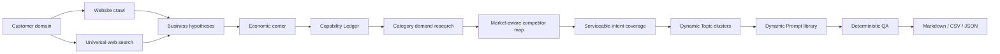

# Dageno Topic & Prompt Generator

> Turn any real customer domain into evidence-backed GEO Topic clusters and Dageno-ready Prompt libraries.

Most prompt generators begin with an industry template. That is the easiest way to generate polished but completely wrong results.

This Skill begins with evidence: crawl the website, search the market, infer what buyers are actually purchasing, build a Capability Ledger, and cover the smallest complete set of serviceable buyer intents.

The output is designed for two jobs:

1. Monitor whether AI answers naturally mention products, providers, competitors, and sources.
2. Identify useful informational questions that belong in SEO/GEO content planning.

## The Core Rule

**A configured model may never fail silently and then present a cached industry template as a completed Skill result.**

If brand research or deterministic QA fails, regenerate or return an explicit error. Static rules are allowed only when no model runtime is available, and the output must be labeled as lower-confidence fallback.

## How The Pipeline Works



### 1. Crawl The Real Business

The crawler prioritizes discovered product, solution, pricing, customer, documentation, use-case, and service pages. It records attempted URLs and filters empty JavaScript shells, CAPTCHA pages, repeated navigation, and generic error pages.

### 2. Build Brand Intelligence

The model identifies:

- canonical brand and business category
- economic center: the decision value buyers actually pay for
- primary decision object and paying buyer
- business hypotheses and uncertainty
- products, services, buyers, JTBD, constraints, and geographies
- monitoring-country recommendations
- out-of-scope assumptions

The website navigation is evidence, not truth. A poorly planned site may expose many products without explaining the workflow, service outcome, procurement simplification, risk reduction, or project delivery that customers actually buy.

### 3. Build A Capability Ledger

Every high-confidence Topic must map to something the customer can credibly deliver:

```text
offering + buyer + job-to-be-done + supported outcome + constraints + evidence
```

Unsupported capabilities do not become Topics just because they are popular search terms.

### 4. Research Demand And Competitors

The Skill searches non-branded category demand around:

- recommendation and provider selection
- comparisons and alternatives
- pricing and value
- reviews, reputation, and trusted sources
- implementation and workflow fit
- risk, compliance, quality, and limitations

Competitors are classified by market, business line, buyer segment, overlap, and differentiation angle. The result is not one global list.

### 5. Generate Coverage-Driven Topics

A Topic is a coherent cluster of questions sharing the same decision object and core JTBD. It is not a feature label, page heading, funnel stage, or generic phrase such as `Product Discovery`.

Topic count is an output of coverage. It is not always five, seven, or ten.

### 6. Generate Two Prompt Pools

`monitoring_core` contains questions likely to make an AI answer name products, brands, providers, competitors, or sources.

`content_opportunity` contains useful, serviceable questions with lower brand-mention probability that are better suited to content production.

Prompt count is also dynamic. A narrow Topic may stop at four to six distinct questions; a complex purchase decision may require twelve or more. Padding and paraphrase inflation are rejected.

### 7. Run Deterministic QA

The included QA checks:

- exact Topic-level Prompt count
- all High-priority coverage cells
- all declared applicable intents
- cross-Topic semantic duplication
- standalone business context
- brand/competitor leakage in non-branded mode
- keyword shape and Prompt metadata
- evidence and coverage-cell mappings
- serviceability, demand plausibility, and mention-likelihood thresholds

One failed attempt receives one model repair pass. A second failure stops the run.

## Validation Examples

These are examples of the reasoning outcome, not cached templates:

| Domain type | Business conclusion | Result shape |
|---|---|---|
| GEO platform | Monitoring -> competitor/citation diagnosis -> execution loop | 9 Topics / 82 Prompts |
| Web-data infrastructure suite | Browser + scraping API + proxy + crawl + agent/MCP + managed data | 9 Topics / 88 Prompts |

The same rules apply to local services, ecommerce, professional services, finance, industrial products, procurement businesses, marketplaces, media, and developer tools.

## Inputs

Required:

```json
{
  "domain": "example.com",
  "market": "United States / North America",
  "outputLanguage": "English"
}
```

Optional controls:

| Field | Values | Default |
|---|---|---|
| `topicMode` | `auto`, `manual` | `auto` |
| `topicCount` | 1-10, manual mode only | coverage-derived |
| `promptMode` | `auto`, `manual` | `auto` |
| `promptCount` | 5-20, manual mode only | coverage-derived per Topic |
| `brandPromptMode` | `exclude`, `include`, `mixed`, `brand_only` | `exclude` |
| `crawlDepth` | 3-12 | 6-8 |
| `targetCountries` | country list | inferred/target market |
| `businessGoal` | optional client context | none |
| `priorityOffering` | optional priority revenue line | inferred |
| `idealCustomer` | optional paying buyer | inferred |
| `excludedOfferings` | explicit scope exclusions | none |

When Dageno controls location through IP, keep region words out of generic Prompts and execute the same Prompt set in separate regional runs.

## Output Schema

Topic fields include:

- `t`: Topic name
- `ty`: Topic Cluster type
- `f`: priority
- `c`: confidence
- `pc`: coverage-derived Prompt count
- `cv`: capabilities, intents, decision criteria, exclusions, and coverage cells
- `ev`: source IDs, confidence reason, and warnings

Prompt fields include:

- `p`: natural user question
- `pt`: `generic`, `branded`, or `competitive`
- `it`: intent type
- `f`: TOFU, MOFU, or BOFU
- `is`: intent score
- `kw`: exactly two keyword phrases
- `pool`: `monitoring_core` or `content_opportunity`
- `sv`: serviceability score
- `dp`: demand plausibility score
- `mp`: answer mention-likelihood score
- `cg`: coverage-cell IDs
- `ev`: evidence and intent justification

See [Evidence Schema](references/evidence-schema.md) and [CSV Output](references/csv-output.md).

## Install As A Codex Skill

```bash
git clone https://github.com/dageno-agents/dageno-online-topic-prompt-generator.git
mkdir -p ~/.codex/skills/dageno-topic-prompt-generator
cp -R dageno-online-topic-prompt-generator/* ~/.codex/skills/dageno-topic-prompt-generator/
```

Then ask Codex:

```text
Generate a non-branded Dageno Topic and Prompt library for https://example.com.
Use the United States as the monitored market and export CSV.
```

## Portable Scripts

Crawl a website with standard-library Python:

```bash
python3 scripts/crawl_and_clean.py "https://example.com"
```

Run deterministic Prompt QA:

```bash
python3 scripts/prompt_qa.py output.json \
  --brand "Example Brand" \
  --mode exclude \
  --context-term "product category"
```

## Hosted Runtime

Use environment variables. Never hardcode keys:

```text
OPENROUTER_API_KEY
OPENROUTER_MODEL
ANTHROPIC_API_KEY
ANTHROPIC_MODEL
OPENAI_API_KEY
OPENAI_MODEL
```

Preferred route: OpenRouter with the strongest available Claude Opus model. See [Security](docs/security.md).

## Repository Structure

```text
.
├── SKILL.md
├── agents/
├── docs/
├── references/
│   ├── coverage-engine.md
│   ├── evidence-schema.md
│   ├── geo-topic-generate.md
│   ├── geo-prompt-generate-by-topic.md
│   ├── category-demand-search.md
│   ├── competitor-generation.md
│   └── prompt-qa.md
└── scripts/
    ├── crawl_and_clean.py
    └── prompt_qa.py
```

## Security And Data Boundary

This repository contains the workflow, schemas, and portable QA tools. It must not contain API keys, customer crawl exports, Dageno project data, private proposal documents, or authorization logs.

## License

MIT
