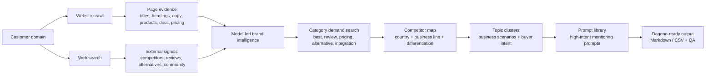

<!-- DAGENO_AGENT_NAV_START -->

**Dageno Agent Project Map / Dageno Agent 项目导航**

If this repo is useful, you may also want the adjacent Dageno Agent projects for GEO, SEO, AI visibility, and content operations.
如果这个仓库对你有帮助，也可以看看这些相邻的 Dageno Agent 项目，用于 GEO、SEO、AI 可见性和内容增长工作流。

| Stage / 阶段 | Project / 项目 | Use it for / 用途 |
| --- | --- | --- |
| Diagnose / 诊断 | [seo-geo-audit](https://github.com/dageno-agents/seo-geo-audit) | SEO + GEO audit workflows for brands and agencies / 面向品牌和服务商的 SEO + GEO 诊断工作流 |
| Topic + prompt generation / Topic + Prompt 生成 | [dageno-online-topic-prompt-generator](https://github.com/dageno-agents/dageno-online-topic-prompt-generator) | Generate Dageno-ready Topic clusters and high-intent monitoring prompts from a real domain / 基于真实网站生成可导入 Dageno 的 Topic 集群和高意图监控 Prompt |
| Content workflows / 内容生产 | [seo-geo-content-engine](https://github.com/dageno-agents/seo-geo-content-engine) | Full SEO/GEO content workflows / 完整 SEO/GEO 内容工作流 |
| Fanout writing / Fanout 写作 | [geo-content-writer](https://github.com/dageno-agents/geo-content-writer) | Turn Dageno fanout into briefs, drafts, and review contracts / 把 Dageno fanout 变成 brief、draft 和 review contract |
| Organic intelligence / 自然增长分析 | [organic-content-intelligence](https://github.com/dageno-agents/organic-content-intelligence) | Search demand, page funnels, intent coverage, and GEO visibility / 搜索需求、页面漏斗、意图覆盖和 GEO 可见性分析 |
| Site architecture / 站点架构 | [geo-site-architecture-audit](https://github.com/dageno-agents/geo-site-architecture-audit) | Audit site structure and turn it into GEO-ready content recommendations / 诊断网站结构并输出 GEO 内容与内链建议 |
| Brand AI performance / 品牌 AI 表现 | [brand-ai-performance-check](https://github.com/dageno-agents/brand-ai-performance-check) | Dense brand diagnostic reports from Dageno API or custom input / 基于 Dageno API 或自定义数据生成品牌 AI 诊断报告 |
| Automation / 自动化 | [n8n-nodes-dageno](https://github.com/dageno-agents/n8n-nodes-dageno) | Dageno API node for n8n automation / 用于 n8n 自动化的 Dageno API 节点 |
| API + MCP playbook / API 与 MCP | [dageno-mcp-growth-playbook](https://github.com/dageno-agents/dageno-mcp-growth-playbook) | GEO reporting, prompt gaps, citation intelligence, and growth execution / GEO 报告、Prompt Gap、引用分析和增长执行手册 |

More projects / 更多项目: [geo-visual-content-engine](https://github.com/dageno-agents/geo-visual-content-engine), [seo-outreach-skill](https://github.com/dageno-agents/seo-outreach-skill), [geo-pre-sale-report-private](https://github.com/dageno-agents/geo-pre-sale-report-private), [GEO-SEO](https://github.com/dageno-agents/GEO-SEO).

Explore all repos / 查看全部项目: [github.com/dageno-agents](https://github.com/dageno-agents) · Product / 产品: [Dageno](https://dageno.ai/?utm_source=github&utm_medium=social&utm_campaign=official)

<!-- DAGENO_AGENT_NAV_END -->

# Dageno Online Topic Prompt Generator

> Generate Dageno-ready GEO Topic clusters and high-intent monitoring prompts from any real customer domain.

Most prompt generators start from an industry template.

This one starts from evidence.

It crawls the customer website, looks for external search signals, asks a model to identify the real business, then turns that context into Topic clusters and Prompt libraries that can be monitored in Dageno.

The goal is not to create generic SEO questions.

The goal is to create prompts that are likely to make AI systems mention:

- brands
- competitors
- products
- vendors
- trusted sources
- pricing
- risks
- alternatives
- implementation choices

It can also generate a competitor map by country, business line, overlap type, and differentiation angle, then use that map to shape competitive Topics and Prompts.

## Why This Exists

GEO monitoring only works when the prompts reflect how real users ask AI systems for help.

If the prompts are too informational, the answer may never mention a brand.

If the prompts are copied from a static industry template, the system can misread a customer website and generate the wrong Topic set.

This Skill is designed to prevent that failure mode.

It asks a harder question:

**What would a real buyer, user, operator, or local customer ask before choosing a product, service, vendor, or alternative?**

## How It Works



The pipeline has six gates:

1. **Crawl** the real website.
2. **Search** for category, competitor, review, and buying-decision context.
3. **Infer** the actual business with a model, instead of forcing a fixed industry label.
4. **Find category demand** from non-branded best/review/pricing/alternative/integration/community searches.
5. **Map competitors** by market, country, business line, overlap, and differentiation angle.
6. **Plan Topics** by buyer roles, jobs-to-be-done, content assets, competitors, and decision criteria.
7. **Generate Prompts** that can trigger product/provider/brand mentions in AI answers.
8. **Run QA and export** grouped Topic/Prompt tables for Dageno monitoring.

## What It Produces

### Topic Clusters

Each Topic is a real demand cluster, not a feature label.

Example fields:

| Field | Meaning |
|---|---|
| `t` | Topic name |
| `ty` | Topic Cluster type |
| `f` | Priority: High / Medium / Low |
| `c` | Confidence score |
| `ev` | Optional evidence metadata |

Supported Topic types:

- `product_category`
- `use_case`
- `persona_need`
- `purchase_decision`
- `risk_validation`
- `competitive_alternative`
- `content_coverage`

### Prompt Rows

Each prompt carries monitoring metadata:

| Field | Meaning |
|---|---|
| `p` | Prompt text |
| `pt` | `generic`, `branded`, or `competitive` |
| `it` | Intent type |
| `f` | Funnel stage: TOFU / MOFU / BOFU |
| `is` | Intent score |
| `kw` | Two keyword phrases for search volume aggregation |

The default mode is non-branded:

```text
brandPromptMode = exclude
```

That means prompts should not contain the customer's brand name, aliases, or competitor names unless the user explicitly asks for branded or mixed monitoring.

Supported brand prompt modes:

- `exclude`: generic non-brand monitoring.
- `include`: generic plus owned-brand validation prompts.
- `mixed`: generic, branded, and limited competitive prompts.
- `brand_only`: owned-brand reputation/entity monitoring only.

## Why Prompt Intent Matters

Dageno tracks how AI answers mention and rank brands.

So the prompt set should not be dominated by questions like:

```text
What is X?
How does X work?
History of X
```

Those can be useful for content planning, but often fail to trigger brand mentions.

This Skill prioritizes prompts like:

```text
Best [category] tools for [use case]
Top [service] providers for [buyer type]
Which [product category] is best for [scenario]?
[category] pricing and reviews
[solution type] alternatives for [pain point]
```

Each prompt must be understandable on its own. Dageno monitors prompts independently, without Topic names or prior chat context, so cross-industry terms like `supplier`, `vendor`, `procurement`, `platform`, `service`, `manufacturer`, `cost`, and `pricing` must include the industry/category/use-case anchor inside the prompt itself.

The rule of thumb:

**At least 80% of prompts should be capable of producing a recommendation, comparison, review, pricing, implementation, risk, vendor, or alternative answer.**

## Topic Count Is Not Fixed

Different businesses need different Topic counts.

The system should decide based on business complexity:

| Business type | Typical Topic count |
|---|---:|
| Local service | 4-5 |
| Simple DTC product | 4-6 |
| Multi-product DTC / hardware | 5-7 |
| B2B SaaS / developer tool | 6-8 |
| Enterprise platform / marketplace | 7-10 |

Manual override is allowed, but the default should be system judgment.

## Output Example

```markdown
# Example Brand — Topic & Prompt Monitoring Configuration

Target site: example.com
Detected industry: AI content operations platform
Topic count strategy: system selected 7 Topics
Brand term strategy: exclude

## Topic 1: AI Search Visibility Platform Selection

Monitoring goal:
Monitor whether the brand is naturally recommended in AI search platform selection scenarios.

Topic Schema: ty=product_category; f=High; c=94

| # | Monitoring Prompt | Brand Term Type | User Intent | Funnel | Intent Score | Keywords |
|---:|---|---|---|---|---|---|
| 1 | Best AI search visibility platforms for SaaS teams | generic | recommendation | BOFU | Transactional:92 | AI search platforms / SaaS visibility tools |
```

## CSV Export

The Skill supports spreadsheet-ready output:

```csv
Topic序号,Topic名称,Topic Cluster类型,用户购买路径,Topic优先级,Topic Prompt数,Prompt序号,Prompt,品牌词类型,用户意图,购买阶段,意图强度,关键词,监测模型,监测地区
```

See [CSV Output](references/csv-output.md).

## Repository Structure

```text
dageno-online-topic-prompt-generator/
  SKILL.md
  agents/
    openai.yaml
  scripts/
    crawl_and_clean.py
    prompt_qa.py
  references/
    online-flow.md
    category-demand-search.md
    competitor-generation.md
    evidence-schema.md
    geo-topic-generate.md
    geo-prompt-generate-by-topic.md
    brand-research.md
    content-compress.md
    shared-prompt-rules.md
    prompt-qa.md
    csv-output.md
  docs/
    agent-guide.md
    security.md
```

## For Humans And Agents

If you are reviewing the Skill:

- Start with this README.
- Read [Agent Guide](docs/agent-guide.md) to understand the exact execution sequence.
- Read [Security](docs/security.md) before adding any API runtime, hosted demo, or customer data.

If you are an AI coding agent:

- Load `SKILL.md` first.
- Load `references/online-flow.md` when implementing or debugging the hosted flow.
- Load `references/category-demand-search.md` before external demand research.
- Load `references/competitor-generation.md` before competitor generation.
- Load `references/evidence-schema.md` when machine output needs reviewable evidence.
- Load `references/geo-topic-generate.md` before generating Topics.
- Load `references/geo-prompt-generate-by-topic.md` and `references/shared-prompt-rules.md` before generating Prompts.
- Load `references/prompt-qa.md` before final QA.
- Never rely on static industry templates without fresh domain evidence.

## Open-Core Boundary

Good to keep in this public repository:

- Skill workflow
- Topic and Prompt schemas
- Prompt intent rules
- CSV output contract
- Safety and fallback policy

Keep private:

- API keys
- customer crawl data
- customer Dageno exports
- proprietary scoring weights
- internal model prompts that include private customer examples
- hosted runtime secrets

## License

MIT
