<!-- DAGENO_AGENT_NAV_START -->

**Dageno Agent Project Map / Dageno Agent 项目导航**

Docs: [English](README.md) · [简体中文](README.zh-CN.md) · [Dageno](https://dageno.ai/?utm_source=github&utm_medium=readme&utm_campaign=topic_prompt_generator)

| Goal | Project | What it does |
| --- | --- | --- |
| Audit a site | [seo-geo-audit](https://github.com/dageno-agents/seo-geo-audit) | Technical, content, trust, off-site, and AI visibility audit |
| Build a monitoring question set | [dageno-online-topic-prompt-generator](https://github.com/dageno-agents/dageno-online-topic-prompt-generator) | Researches the business, then generates evidence-backed Topics and Prompts |
| Produce SEO/GEO content | [seo-geo-content-engine](https://github.com/dageno-agents/seo-geo-content-engine) | Research, intent, structure, draft, metadata, FAQ, and GEO packaging |
| Diagnose organic-content performance | [organic-content-intelligence](https://github.com/dageno-agents/organic-content-intelligence) | Connects GSC, GA4, crawl, intent, and AI/GEO signals |
| Improve GEO site architecture | [geo-site-architecture-audit](https://github.com/dageno-agents/geo-site-architecture-audit) | Finds missing AI-answerable pages and internal links |

<!-- DAGENO_AGENT_NAV_END -->

# Dageno Topic & Prompt Generator

> Turn any real customer website into an evidence-backed GEO monitoring question system.

[](SKILL.md)
[](LICENSE)
[](references/csv-output.md)

Most Prompt generators start with a category template and produce plausible-looking questions. That fails as soon as the website sells something more nuanced than the template understands.

This Skill starts from evidence. It crawls the website, studies external demand and competitors, identifies what buyers are actually paying for, and maps both the questions the customer can credibly answer and the wider category questions needed for an unbiased benchmark.

It is built for GEO teams, SEO specialists, agencies, growth teams, and Dageno operators who need a defensible monitoring baseline rather than a prompt dump.

## What You Get

- Business intelligence grounded in the target website and external search.
- A Capability Ledger showing what the customer can credibly deliver.
- A competitive decision-surface map: the reasons buyers choose, compare, reject, or verify providers.
- Coverage-driven Topics. Topic count is not fixed at 5, 7, or 10.
- Coverage-driven Prompts. A simple Topic may need 3-7; a complex one may need 20+.
- Separate `monitoring_core` and `content_opportunity` pools.
- Four coverage layers that prevent favorable-prompt bias: brand core, industry benchmark, competitive whitespace, and out-of-scope reference.
- Market-aware competitors and evidence mappings.
- Deterministic QA for coverage, duplication, brand leakage, and business context.
- Markdown, CSV-ready, and machine-readable outputs.

## Why Topic/Prompt Design Matters

A GEO monitor is only as useful as the questions it tracks.

If the question set is too broad, AI answers may never name a product or provider. If it is too narrow, the monitor misses important buying scenarios. If it is copied from an industry template, the dashboard can look precise while measuring the wrong market.

This Skill treats Topic/Prompt design as a measurement-system problem:

```mermaid
flowchart LR
  A["Customer domain"] --> B["Crawl + web research"]
  B --> C["Business hypotheses"]
  C --> D["Economic center"]
  D --> E["Capability Ledger"]
  E --> F["Decision-surface map"]
  F --> G["Brand + category intent universes"]
  G --> H["Layered Topic clusters"]
  H --> I["Prompt pools"]
  I --> J["Deterministic QA"]
  J --> K["Dageno / CSV / JSON"]
```



## The Core Concepts, In Plain English

### Capability Ledger

An evidence-backed inventory of:

```text
offering + buyer + job-to-be-done + supported outcome + constraints + evidence
```

Confirmed capabilities define the core KPI, but they do not define the entire industry benchmark. Material category demand and competitor-owned decision surfaces are retained in separate layers.

### Competitive Decision Surface

A buyer-readable reason to choose, reject, compare, or verify a provider. Depending on the business, this may include:

- product or bundle fit
- buyer role or project stage
- customization and integration
- quality, safety, certification, or compliance
- pricing, MOQ, TCO, and commercial terms
- lead time, implementation, logistics, and local availability
- reviews, alternatives, warranties, and risk

These are examples, not a template. A surface is created only when evidence supports it.

### Topic

A coherent group of questions sharing the same decision object and core job-to-be-done. A Topic is not a navigation label, funnel stage, or generic phrase such as `Product Discovery`.

### Prompt

A standalone question that a real user could send to an AI assistant. It must carry enough category and scenario context to make sense without the Topic title or previous chat history.

## Example: From Website Pages To Buyer Decisions

Imagine a manufacturer whose website lists lithium-ion, LiPo, LiFePO4, 18650, and dozens of voltage/capacity pages. A page-based generator may create one Topic per product family.

The evidence-led model may instead discover that buyers are evaluating:

| Decision surface | Possible Topic |
| --- | --- |
| Engineering and customization | Custom Battery Pack OEM & Engineering Design |
| Chemistry and performance fit | Cell Chemistry, Format & Performance Selection |
| Application fit | Industrial, Robotics & Medical Battery Solutions |
| Trust and proof | Battery Safety, BMS & Compliance |
| Supplier risk | Factory Quality & OEM Supplier Verification |
| Commercial feasibility | Pricing, MOQ, Prototype & Lead Time |

That structure is closer to how procurement teams, engineers, and product owners ask AI for recommendations.

## Two Prompt Pools

`monitoring_core` is designed to trigger products, brands, providers, competitors, or trusted sources in AI answers.

`content_opportunity` captures real informational demand that is useful for SEO/GEO content planning but less likely to produce a brand mention.

The ratio is dynamic. Decision-led businesses usually need more monitoring prompts; media or education businesses may legitimately need more informational coverage.

## Four Coverage Layers

| Layer | Purpose | Visibility use |
| --- | --- | --- |
| `brand_core` | Confirmed customer capabilities and buyer decisions | Core KPI |
| `industry_benchmark` | Material category demand regardless of current customer strength | Category benchmark |
| `competitive_whitespace` | Valuable intents competitors serve but the customer does not yet own | Opportunity analysis |
| `out_of_scope_reference` | Relevant category context too far from the current offer | Diagnostic only |

The Skill never blends all four into one headline score. Measuring only `brand_core` inflates visibility; measuring every category question as if the customer should win it unfairly depresses visibility.

## Automatic Scope, Without Silent Truncation

Topic and Prompt counts are outputs of coverage, not input defaults.

The hosted implementation currently uses request-safety boundaries of 24 Topics and 32 Prompts per Topic. These are runtime guardrails, not recommended quantities. If a verified scope exceeds them, the system must ask for a split by business line, buyer segment, or market instead of silently dropping coverage.

## Quick Start

Install as a Codex Skill:

```bash
git clone https://github.com/dageno-agents/dageno-online-topic-prompt-generator.git
mkdir -p ~/.codex/skills/dageno-topic-prompt-generator
cp -R dageno-online-topic-prompt-generator/* ~/.codex/skills/dageno-topic-prompt-generator/
```

Then ask:

```text
Generate a non-branded Dageno Topic and Prompt library for https://example.com.
Research the real business first, use the United States as the monitored market,
keep region terms out of Prompts because location is controlled by IP, and export CSV.
```

Useful optional context:

```json
{
  "domain": "https://example.com",
  "market": "United States / North America",
  "outputLanguage": "English",
  "businessGoal": "Prioritize enterprise buyers",
  "priorityOffering": "Custom manufacturing projects",
  "idealCustomer": "OEM procurement and engineering teams",
  "excludedOfferings": "Consumer replacement batteries",
  "brandPromptMode": "exclude"
}
```

## Brand And Region Policies

Brand modes:

- `exclude`: generic discovery; no owned or competitor names.
- `include`: generic discovery plus owned-brand validation.
- `mixed`: generic, branded, and limited competitive questions.
- `brand_only`: reputation and brand-accuracy monitoring only.

When Dageno controls location through IP, keep region words out of generic Prompts and run the same question set from each target market.

## Deterministic QA

The Skill checks:

- serviceability and evidence
- High-priority decision-surface coverage
- applicable intent coverage
- standalone business context
- exact and semantic duplicates across Topics
- brand and competitor leakage
- monitoring/content pool thresholds
- keyword and evidence mappings

Run the portable QA tool:

```bash
python3 scripts/prompt_qa.py output.json \
  --brand "Example Brand" \
  --mode exclude \
  --context-term "product category"
```

If model-led research or QA fails, the hosted workflow must repair or stop explicitly. It must not disguise an old industry template as a successful result.

## Repository Map

```text
.
├── SKILL.md                         # Complete operating contract
├── agents/openai.yaml               # Skill discovery metadata
├── references/
│   ├── coverage-engine.md           # Canonical coverage algorithm
│   ├── brand-research.md            # Business-intelligence rules
│   ├── geo-topic-generate.md        # Topic contract
│   ├── geo-prompt-generate-by-topic.md
│   ├── competitor-generation.md
│   ├── prompt-qa.md
│   └── csv-output.md
├── scripts/
│   ├── crawl_and_clean.py
│   └── prompt_qa.py
└── docs/
    ├── agent-guide.md
    └── security.md
```

## Runtime And Security

The workflow supports model execution through OpenRouter, OpenAI, or Anthropic. Runtime secrets belong in environment variables and must never be committed.

```text
OPENROUTER_API_KEY
OPENROUTER_MODEL
OPENAI_API_KEY
OPENAI_MODEL
ANTHROPIC_API_KEY
ANTHROPIC_MODEL
```

The repository must not contain customer crawl exports, private reports, authorization logs, or API keys. See [Security](docs/security.md).

## License

MIT
