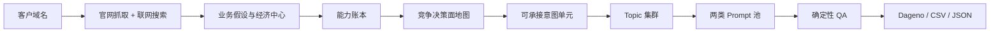

# Dageno Topic & Prompt Generator

> 把任意真实客户网站，转换成一套有业务证据、可导入 Dageno 的 GEO 监控问题体系。

[English](README.md) · [完整 Skill](SKILL.md) · [方法论文章](docs/wechat-geo-topic-prompt-methodology.zh-CN.md) · [Dageno](https://dageno.ai/?utm_source=github&utm_medium=readme&utm_campaign=topic_prompt_generator)

## 它解决的不是“生成几个问题”

GEO 监控的准确度，首先取决于你监控了什么问题。

很多生成器从行业模板开始：输入一个 SaaS 网站，就生成“最好用的软件”“软件价格”“软件替代品”；输入一个制造商，就按产品目录机械拆 Topic。结果看起来完整，却可能没有理解客户真正卖什么、谁负责采购、用户为什么选择供应商。

这套 Skill 从证据开始：

1. 抓取官网真实页面。
2. 联网研究品牌、品类需求和竞争环境。
3. 判断客户真正的业务、付费买家与商业边界。
4. 建立客户能够承接的 Capability Ledger（能力账本）。
5. 建立买家选择、比较、拒绝和验证供应商时的“竞争决策面”。
6. 把全部高价值、可承接意图聚类成 Topic。
7. 为每个 Topic 生成不重复、可独立理解的 Prompt。
8. 用确定性 QA 检查覆盖、重复、品牌词和证据。

## 一张图看懂流程



## 四个核心概念

### 1. 能力账本

每个高优先级 Topic 都必须对应客户真实能交付的能力：

```text
产品或服务 + 付费买家 + 用户任务 + 可交付结果 + 限制条件 + 证据
```

一个搜索需求再热门，如果客户无法承接，就不应该成为核心 Topic。

### 2. 竞争决策面

买家在选择、拒绝、比较或验证供应商时真正关心的维度，例如：

- 产品或组合方案是否适配
- 特定角色、项目阶段和业务流程
- 定制、兼容和集成能力
- 质量、安全、认证和合规证明
- 价格、MOQ、总体成本和合同条件
- 交期、实施、物流和地区服务
- 评价、替代方案、质保和风险

这些只是通用维度，不是固定模板。系统只会保留有网站或外部证据、客户又确实能承接的决策面。

### 3. Topic

Topic 是共享同一决策对象和核心用户任务的一组问题，不是官网导航、关键词分类或漏斗阶段。

Topic 数量由业务覆盖决定，不固定为 5、7 或 10。

### 4. Prompt

Prompt 是用户可以单独发给 ChatGPT、Gemini、Perplexity 等产品的问题。每条 Prompt 必须脱离 Topic 标题和对话历史也能被理解。

简单 Topic 可能只需要 3-7 条；复杂 B2B 决策可能需要 20 条以上。系统不会为了凑数量重复改写同一个问题。

## 两种 Prompt 池

### 可见度监控池 `monitoring_core`

更容易让 AI 回答出现产品、品牌、供应商、竞品或第三方信源，适合监控推荐、对比、价格、风险、实施和替代方案。

### 内容机会池 `content_opportunity`

用户确实会问、客户也能回答，但品牌提及概率较低，更适合指导 SEO/GEO 内容生产。

系统会根据行业和商业模式动态决定两类 Prompt 的比例。

## 一个简单例子

假设某制造商官网列出了几十种电芯、容量和电压页面。传统方法可能按产品目录拆 Topic；这套 Skill 会继续研究买家的决策过程：

| 买家决策面 | 可能形成的 Topic |
| --- | --- |
| 工程设计和定制 | 定制电池 OEM 与工程设计 |
| 化学体系和性能适配 | 电芯体系、规格与性能选型 |
| 应用适配 | 工业、机器人与医疗设备电池方案 |
| 安全证明 | 电池安全、BMS 与认证合规 |
| 供应商风险 | 工厂质量与 OEM 供应商验证 |
| 商业可行性 | 报价、MOQ、样品与交期 |

这样的 Topic 更接近采购、工程和产品负责人真实询问 AI 的方式。

## 快速安装

```bash
git clone https://github.com/dageno-agents/dageno-online-topic-prompt-generator.git
mkdir -p ~/.codex/skills/dageno-topic-prompt-generator
cp -R dageno-online-topic-prompt-generator/* ~/.codex/skills/dageno-topic-prompt-generator/
```

然后对 Codex 说：

```text
请为 https://example.com 生成一套不含品牌词的 Dageno Topic 和 Prompt。
先抓取官网并联网研究真实业务，目标监控市场为美国，地区由 IP 控制，
所以 Prompt 不写国家词，最后导出 CSV。
```

还可以补充：重点业务目标、优先产品线、理想付费客户和明确排除的业务。用户提供的战略信息优先于系统推断，但仍需与网站证据相互校验。

## 数量与安全边界

自动模式不会把 10 当成目标。

在线实现目前设置了 24 个 Topic、每 Topic 32 条 Prompt 的单次请求安全边界。这是运行保护，不是推荐数量。若证据证明需要更大范围，系统应提示按业务线、买家或市场拆分，而不是静默删除覆盖。

## 品牌词与地区策略

- `exclude`：自然发现，不含自有品牌和竞品名称。
- `include`：自然发现 + 自有品牌验证。
- `mixed`：自然发现 + 品牌验证 + 有限竞品问题。
- `brand_only`：只用于品牌知识、声誉和舆情监控。

如果 Dageno 通过 IP 控制地区，Prompt 中通常不再写国家词；同一套问题可在不同地区分别运行。

## QA 检查什么

- 客户是否真实能承接问题中的需求
- 高优先级决策面是否完整覆盖
- Prompt 是否存在重复或换词改写
- 单条 Prompt 是否能脱离上下文独立理解
- 非品牌模式是否泄漏品牌或竞品名称
- 是否有明确的业务与品类锚点
- 是否保留证据、意图和覆盖单元映射

配置了模型时，品牌研究或 QA 失败必须修复或明确停止，不能偷偷退回旧行业模板并显示“执行成功”。

## 输出

- Markdown 监控配置
- CSV-ready Topic/Prompt 表格
- 机器可读 JSON
- Competitor Map
- Capability Ledger
- Coverage Report
- Deterministic QA Report

## 深入阅读

- [完整运行规范](SKILL.md)
- [覆盖引擎](references/coverage-engine.md)
- [Topic 生成规范](references/geo-topic-generate.md)
- [Prompt 生成规范](references/geo-prompt-generate-by-topic.md)
- [确定性 QA](references/prompt-qa.md)
- [公众号文章：你的 GEO 监控，可能从第一批 Prompt 就错了](docs/wechat-geo-topic-prompt-methodology.zh-CN.md)

## 安全

API Key 必须通过环境变量配置。仓库不得包含客户抓取数据、私有报告、授权日志或任何密钥。详见 [Security](docs/security.md)。

## License

MIT
